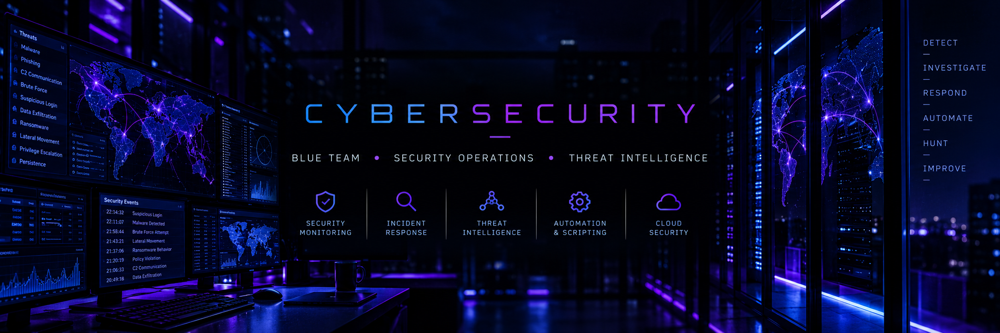

<p align="center">
  
</p>

<div align="center">

# Leonardo Rodrigues

### Cybersecurity · Blue Team · Security Operations

`Threat Detection` · `Incident Response` · `Threat Intelligence` · `Endpoint Security`

</div>

---

## About

Cybersecurity professional focused on **Security Operations**, threat detection, incident response, and endpoint security.

Computer Science undergraduate expanding my knowledge in **Offensive Security** and **Machine Learning applied to Cybersecurity**.

---

## Security Stack

<p>
  
  
  
  
  
</p>

## Development & Systems

<p>
  
  
  
  
</p>

---

## Current Focus

```text
[+] Machine Learning for Threat Detection
[+] Anomaly Detection
[+] Offensive Security
[+] Security Automation
```

---

## Education

**B.Sc. Computer Science** · Universidade Paulista (UNIP)

---

<div align="center">

[](https://www.linkedin.com/in/leonardo-rodrigues-3422b02b6/)

</div>
